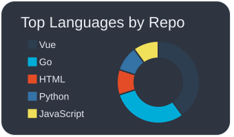

  

  
  
  

## Tech stack

  

## What I build

| | Area | Examples |
|---|---|---|
| ⚙️ | Backend & API | Go, gRPC / Connect, data modeling |
| 🖥️ | Web frontend | TypeScript, React, Vue / Nuxt |
| 🧰 | Developer tools | Chrome extensions, CLI tools, workflow automation |

## GitHub activity

  

  Thanks for stopping by. Feel free to explore my repositories.

